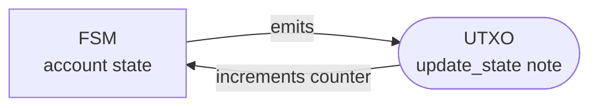

# miden-ntx-state-machine

A minimal demonstration of a **self-perpetuating Miden network account**, a finite state machine that drives itself forward on-chain, with no further user input after the initial seed.

**Live on testnet:** [`mtst1arzu6susk9ymcsps20zym9l9ug45xchl`](https://testnet.midenscan.com/account/mtst1arzu6susk9ymcsps20zym9l9ug45xchl). Watch the counter tick on Midenscan.

## What is a finite state machine?

A **finite state machine (FSM)** is a computational model with a finite set of states and a transition function that maps `(current_state, input) → next_state`. Each step the machine reads an input, advances to the next state, and (optionally) emits an output. Classic examples: traffic lights, regex engines, vending machines.

This repo implements an FSM on Miden where:
- **State** lives in account storage (a counter at slot `miden_ntx_state_machine::counter`).
- **Input** is a network note (`update_state`) addressed to the account.
- **Transition** is the MASM `tick` procedure: it increments the counter and emits the next input note.
- **Output** is a fresh `update_state` note tagged back to the account, which the network picks up and feeds into the next transition.

The "input" and "output" are both UTXO-style notes; each transition consumes one note and produces one note, and the produced note becomes the input to the next transition.

## The loop



Each cycle: the FSM consumes a UTXO note, increments its counter, and emits a new UTXO note tagged back at itself. The network transaction builder picks up that note in the next block and feeds it back in, so the arrow loops forever with no user transactions.

## Caveat: only works while fees are zero

This self-perpetuating loop is only sustainable on the current testnet **because network transaction fees are 0**. Every tick is "free": the account never has to pay for its own execution, so it can run indefinitely.

Once Miden enables fees, a self-driving FSM like this will need to **fund its own transactions** (e.g. by holding fungible asset balance the network builder can charge against each tick). When that balance runs out, the network builder will stop processing the FSM's notes and **the machine halts**. A real production FSM would need either an external top-up mechanism or a built-in revenue source per tick to stay alive.

## What it does

1. Deploys a network account (`AccountStorageMode::Network`, immutable code, `NoAuth`).
2. The user submits one initial `update_state` network note tagged for the account.
3. The network transaction builder consumes the note. Inside that consumption the account:
   - Increments a counter in storage (`miden_ntx_state_machine::counter`).
   - Emits a fresh `update_state` note with `serial_num + 1`, tagged back to itself.
4. That output note becomes a network note in the next block, the network builder consumes it, and the loop continues forever, driven entirely by the network with no further user transactions.

This is the network-counter tutorial example
(`miden-tutorials/rust-client/src/bin/network_notes_counter_contract.rs`)
extended so the consumed note re-emits itself.

## Run

### Unit tests (no network)

```sh
cargo test
```

`tests/mock_chain.rs` builds the state machine on `miden_testing::MockChain`, has it consume one seeded `update_state` note, and asserts:
- the counter ticks from 0 → 1 (and 1 → 2 for the two-tick test),
- exactly one output note is emitted per tick,
- the emitted note's recipient digest matches `(serial_num + 1, same script, empty storage)`,
- the emitted note's tag points back at the state machine,
- feeding the emitted note back through a second tx ticks again, closing the chain on itself.

### Testnet demo binary

```sh
cargo run --release
```

Deploys to **testnet**, seeds with one note, then polls the account until the counter reaches 5, printing every tick. After it exits, the chain keeps ticking on testnet; re-run a quick state read to confirm.

MASM debugging is enabled (`in_debug_mode(true)`); `debug.stack` calls inside the MASM print to stdout during transaction proving.

## How `tick` re-emits the next note

The interesting MASM lives in `masm/accounts/state_machine.masm` under `pub proc tick`. It:
1. Calls `increment_count` (storage slot named `miden_ntx_state_machine::counter`).
2. Issues the `INPUT_NOTE_GET_STORAGE_INFO_OFFSET` kernel syscall directly to obtain the active note's storage commitment without consuming it (the public `active_note::get_storage` wrapper drops it).
3. Reuses the active note's script root and serial number (bumped by 1) to build the new recipient via `note::build_recipient_hash`.
4. Computes the self-tag `(account_id_prefix >> 32) & 0xFFFC0000`, the same thing `NoteTag::with_account_target` computes on the Rust side.
5. Calls `output_note::create` with `[tag, NoteType::Public, RECIPIENT]`.

The new note has the same script, same (empty) storage, same tag, and `serial_num + 1`, so its id is distinct from the consumed note's but its shape is identical. The network transaction builder picks it up by tag in the next block and the cycle repeats.
